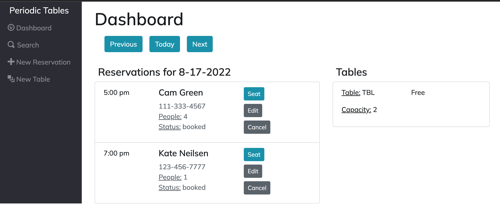
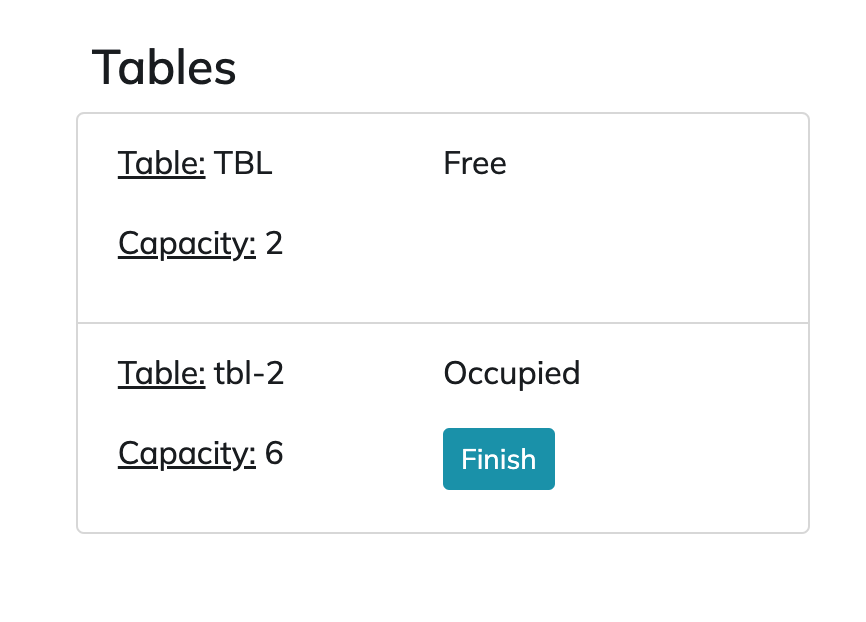
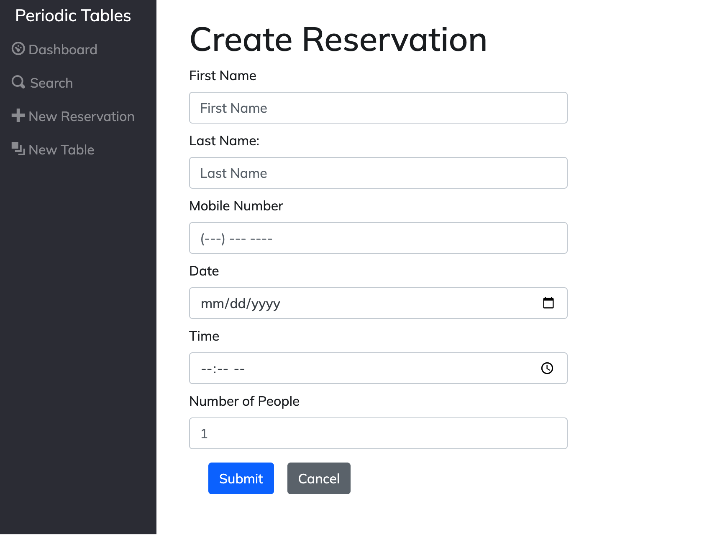
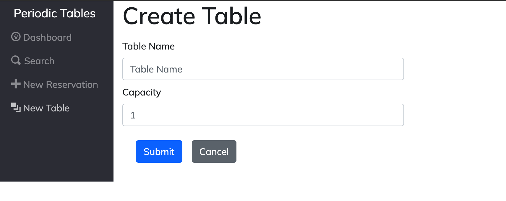
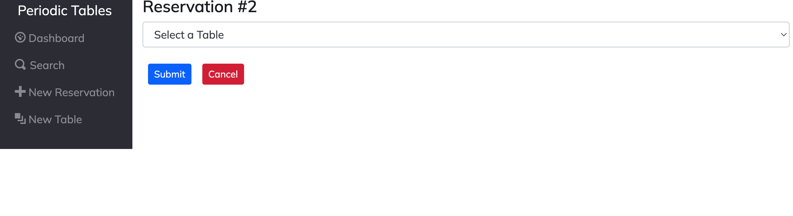
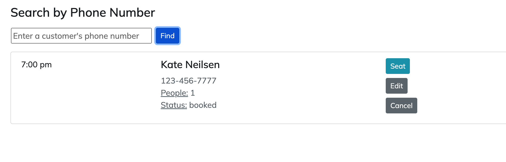
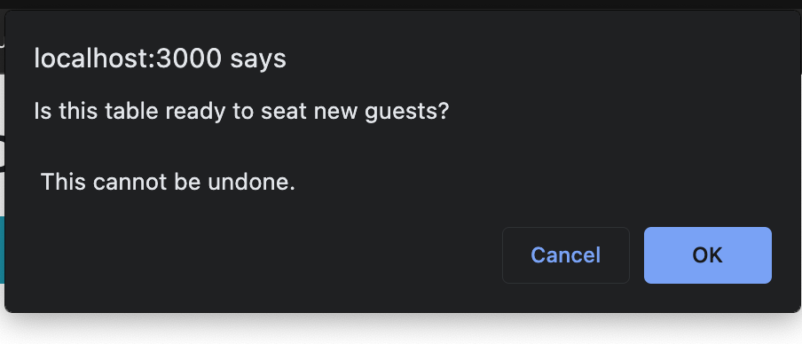
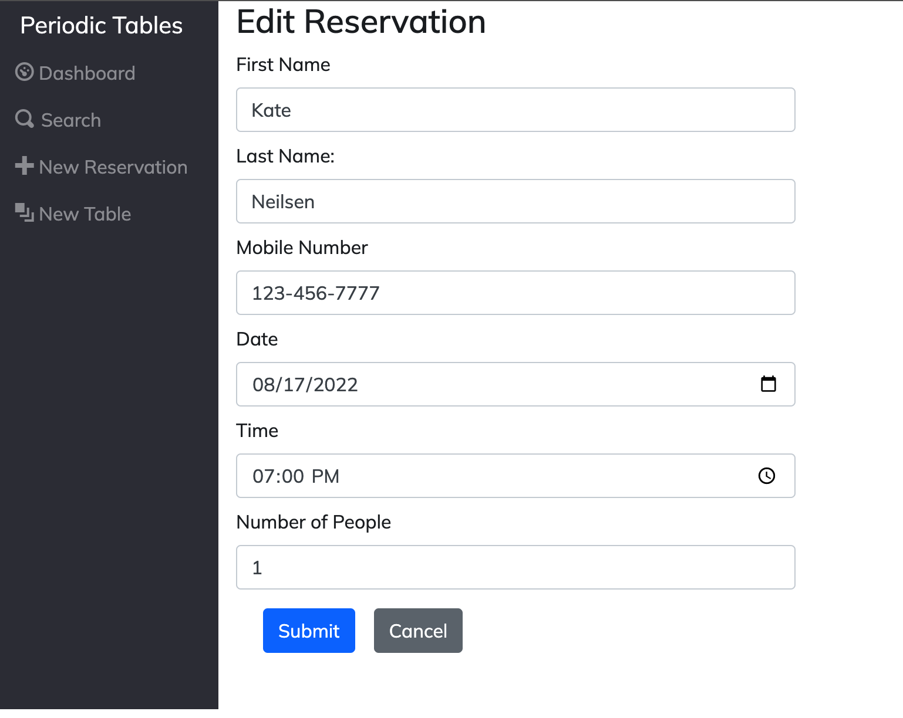
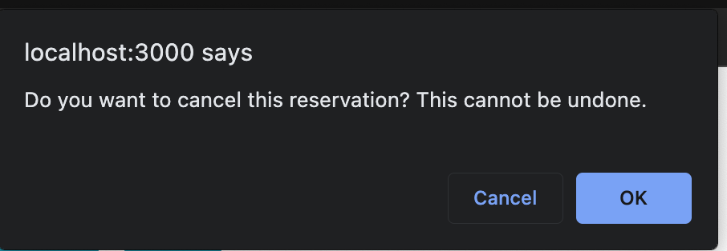

# Restaurant Reservation System

The Restaurant Reservation System is an application, for managing schedualing for restaurants staff. Restaurant workers can track, edit, and cancel reservations, as well as monitor available tables and add new tables as needed.

**Live Application:**
<https://restaurant-reservations-4emjxwc0v-kateneilsen.vercel.app>

## Technology Used

- React.js
- HTML
- CSS
- Bootstrap
- Express
- PostgreSQL
- Knex.js

## API Documentation

| Method | URL                                  | Description                                                     |
| ------ | ------------------------------------ | --------------------------------------------------------------- |
| GET    | /reservations                        | Lists reservations for current date                             |
| POST   | /reservations                        | Creates a new reservation                                       |
| GET    | /reservations?date=YYYY-MM-DD        | Lists all reservations for a given date                         |
| GET    | /reservations/:reservation_id        | Reads reservation by reservation id                             |
| PUT    | /reservations/:reservation_id        | Updates reservation by reservation id                           |
| PUT    | /reservations/:reservation_id/status | Updates reservation status by reservation id                    |
| GET    | /tables                              | Lists all tables                                                |
| POST   | /tables                              | Creates a new table                                             |
| PUT    | /tables/:table_id/seat               | Updates table with a given reservation id (seats a reservation) |
| DELETE | /tables/:table_id/seat               | Removes a reservation id from the table                         |

## Screenshots of Application

Dashboard lists reservations by date and lists all tables

Select "New Reservation" on the navbar to create a reservation

Select "New Table" on the navbar to Create a Table

Once a reservation is booked, you can select the "Seat" button to assign a reservation to a table

Select "Search" on the navbar to search for a reservation by phone number

Select the finish button on a table to remove the reservation id. The table will now display "free"

Select the edit button on a reservation to update the reservation data

Select "Cancel" to cancel a reservation. The reservation will no longer appear on the dashboard.

## Installation

1. Fork and clone this repository.
2. Run <mark>cp ./back-end/.env.sample ./back-end/.env</mark>
3. Update the ./back-end/.env file with the connection URL's to your database instance.
4. Run <mark>cp ./front-end/.env.sample ./front-end/.env</mark>
5. Include your backend connection within ./front-end/.env (defaults to http://localhost:5000).
6. Run <mark>npm install</mark> to install project dependencies.
7. Run <mark>npm run start</mark> to start the server.
